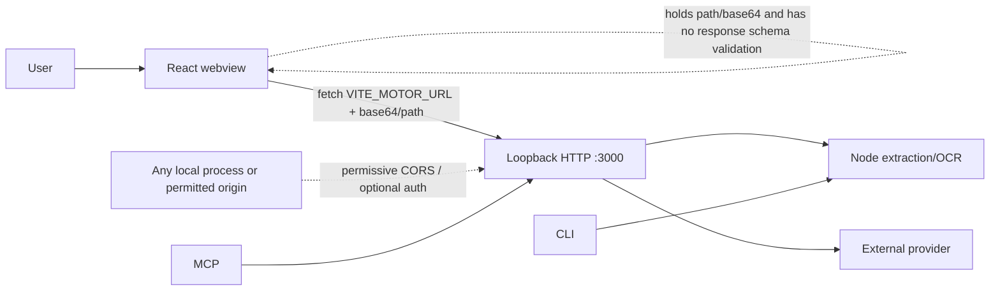
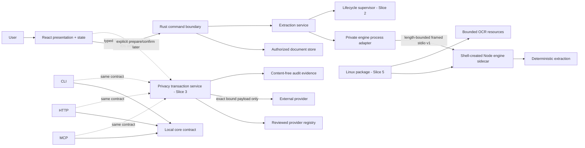

# Technical Design: NeluPDF Full Audit

**Change:** `nelupdf-full-audit`
**Status:** Design complete after corrective gate closure
**Primary platform:** Linux
**Artifact store:** Hybrid (OpenSpec + Engram)
**Delivery rule:** Dependency-ordered Slice 1 review units, each forecast at no more than 400 authored changed lines

## 1. Design intent and evidence

This design defines the target architecture for the approved six-slice program and gives implementation-ready detail for Slice 1. It preserves these non-negotiable decisions:

- Rust mediates every desktop engine operation.
- The webview has no engine URL, port, token, launch secret, path authority, or equivalent engine authority.
- Deterministic local extraction is the default and works without external networking.
- Linux is the first supported release platform.
- A later single external-LLM contract covers desktop, CLI, HTTP, and MCP with no operational raw-content bypass.
- Slice 1 is test harnesses, a real Rust boundary, deterministic local extraction, the bounded one-request process lifecycle needed to make that path cancellable/readiness-aware, and immediate origin/CORS/path/CSP closure. Persistent supervision, OCR, external providers, and release packaging remain later slices.
- Every applicable slice supplies both internal automated evidence and visual/accessibility evidence.
- Work is chained in dependency order and subdivided before apply when a review unit is forecast above 400 authored changed lines.

Repository evidence comes from `proposal.md`, all eight domain specifications, `exploration.md`, `openspec/project-context.md`, and targeted reads of the installed project. The installed desktop is React 19.1, TypeScript 5.8, Vite 7, Tauri 2, and Rust 2021. Its Tauri configuration uses the v2 schema; `Cargo.toml` declares `tauri = "2"`; `lib.rs` registers only the template `greet` command; CSP is `null`; and the default capability grants `opener:default`. The current React application directly fetches `VITE_MOTOR_URL`, retains base64 document bytes, trusts unvalidated JSON, and sends native paths to unauthenticated path routes. The root engine is Node 22 ESM, with a 12 MiB decoded PDF limit, 100-page default, 80,000-character default, 4,000 characters per page, and a 1 MiB HTTP response limit. The current Node baseline is 143/144 because of a known randomized pseudonymization assertion.

CodeGraph's `.codegraph/` directory exists, but this executor runtime exposed no CodeGraph query or shell surface. Structural conclusions therefore use the supplied exploration plus targeted source reads rather than broad filesystem inference.

### Official Tauri v2 rationale

The design uses only documented Tauri v2 concepts and keeps exact API spelling subject to compilation against the installed lockfiles during implementation:

- Rust commands are the webview IPC boundary and are registered through Tauri's command mechanism: <https://v2.tauri.app/develop/calling-rust/>.
- Packaged external binaries are declared as sidecars/`externalBin`; sidecar process ownership belongs to native code, not the webview: <https://v2.tauri.app/develop/sidecar/>.
- Capabilities bind windows/webviews to explicit permissions and are the least-privilege control plane for IPC/plugin access: <https://v2.tauri.app/security/capabilities/>.
- The testing strategy follows Tauri's test overview and frontend IPC mocking guidance: <https://v2.tauri.app/develop/tests/> and <https://v2.tauri.app/develop/tests/mocking/>.
- Tauri WebDriver testing is reserved for later Linux CI, following the official platform and CI guidance: <https://v2.tauri.app/develop/tests/webdriver/> and <https://v2.tauri.app/develop/tests/webdriver/ci/>.
- Tauri configuration provides the production CSP control under `app.security.csp`; capabilities remain a separate IPC/plugin permission layer: <https://v2.tauri.app/reference/config/#securityconfig> and <https://v2.tauri.app/security/capabilities/>.

These official sources justify the boundary and control plane, not an unchecked API spelling. Slice 1 implementation MUST validate the installed Tauri v2 config schema and lockfile before editing `tauri.conf.json`; it MUST compile and run an IPC smoke test to confirm whether the installed runtime requires `ipc:`, `http://ipc.localhost`, both, or neither in `connect-src`. Only the source(s) proven necessary for Tauri IPC may remain. Exact Rust sidecar/process plugin constructors, event APIs, capability identifiers, and CSP config serialization are implementation gates, not design assumptions; compilation/schema validation failure blocks the work unit rather than permitting a broader policy.

No design decision assumes that `bundle.targets: "all"` packages Node or OCR resources. It does not.

## 2. Context and constraints

### 2.1 Current architecture



Current failures are architectural, not cosmetic: the webview chooses transport; Rust owns no process or document authority; an arbitrary service can occupy the expected endpoint; optional authentication breaks the desktop; origin/CORS and arbitrary-path routes can confer unsafe local authority; external privacy flows are inconsistent; and packaging does not produce a self-contained desktop.

### 2.2 Target architecture



The decisive property is that the webview terminates at typed Tauri IPC. The engine channel is a separate private native channel created and held by Rust. No engine network coordinates or credentials cross into JavaScript.

### 2.3 Constraints

1. Preserve existing deterministic behavior where it satisfies the new authority and privacy invariants.
2. Do not expose unbounded OCR until Slice 2 defines and verifies resource controls.
3. Do not treat loopback, CORS, a fixed port, or an unverified process response as identity.
4. Do not make provider configuration a startup dependency.
5. Validate untrusted input at each system boundary: webview input in Rust, engine output in Rust, PDF content in the engine, and provider output in the privacy service.
6. Keep raw document content, transformed payloads, mappings, credentials, and sensitive paths out of routine logs and diagnostics.
7. Preserve unrelated tracked and untracked user work; candidate scope is explicit per work unit.
8. Strict TDD is active. The harness and failing tests precede behavior changes.
9. Final support and legal claims cannot exceed verified evidence. This design does not claim worldwide legal compliance.

## 3. Architecture decisions

### ADR-001: Use a private, Rust-owned stdio sidecar protocol

**Decision:** Select a private framed stdio sidecar as the incremental engine protocol behind Rust.

#### Alternatives

| Alternative | Advantages | Risks and cost | Decision |
| --- | --- | --- | --- |
| Private stdio sidecar | No listening socket, Origin, CORS, port collision, or bearer token; child identity is tied to the process Rust created; bounded stdin/stdout are easy to supervise; compatible with Tauri `externalBin` packaging | Requires an explicit framing protocol; stdout must be protocol-only; Node/runtime/OCR packaging remains later work | **Selected** |
| Hidden authenticated loopback | Reuses current HTTP server and tests; process can support multiple requests | Still requires random port, per-launch secret, endpoint/PID binding, Host/Origin policy, CORS analysis, token hygiene, response bounds, and stale-process defenses; a hidden URL is not identity | Rejected as default; contingency only if a documented stdio blocker is proven |
| In-process Rust rewrite | Removes Node runtime and child-process boundary; potentially simplest final package | Rewrites extraction/parser/OCR behavior, creates result drift, expands the first review dramatically, and delays fixing the current trust boundary | Rejected for this program; may be evaluated after contracts and parity fixtures stabilize |

#### Why mediation is real

Rust mediation is not a proxy over unauthenticated HTTP:

- Rust launches the exact configured development executable or packaged sidecar; it does not discover an arbitrary process by port.
- Rust owns the child handle and both protocol pipes.
- The engine does not listen on a TCP socket for desktop operations.
- The webview never receives the executable path, pipe handle, endpoint, secret, or raw child output.
- Rust validates the request before sending it and validates the response envelope and domain fields before returning anything to JavaScript.
- A malformed frame, extra stdout, unsupported protocol, timeout, cancellation, or child exit becomes a typed Rust error.
- Production desktop code contains no direct HTTP fallback. Rollback reverts the slice; it never restores webview-to-loopback access.

#### Incremental migration

- **Slice 1:** a one-request child adapter creates a fresh private process per extraction. It has a small, fully specified per-operation state registry, readiness snapshot, concurrent cancellation command, deadlines, and cleanup gate. It sends one bounded request, receives one bounded response, then requires clean child termination. This is the minimum lifecycle needed to satisfy the Slice 1 boundary; it is not a persistent supervisor.
- **Slice 2:** replace the one-request adapter behind the same Rust trait with a persistent supervised sidecar, identity/capability handshake, bounded queue, restart budget, app shutdown, and OCR controls while preserving the Slice 1 operation IDs, cancellation outcomes, terminal precedence, and public readiness vocabulary.
- **Slice 5:** package the engine according to Tauri v2 `externalBin` rules and bind integrity/provenance evidence. The exact Node packaging form—compiled executable versus pinned runtime plus resources—remains a release decision, but the stdio contract does not change.

The runtime implementation uses a `ProcessEngineAdapter`; tests use `FakeEngineAdapter`. No product path returns fake extraction data.

#### Rollback

Each migration step is additive behind the stable command contract. Reverting Slice 1 restores the prior application version, not a direct-HTTP compatibility path. Reverting the Slice 2 supervisor can restore the Slice 1 one-request process adapter. Provider work can be disabled independently without affecting local extraction.

### ADR-002: Use opaque document capabilities, never webview paths

**Decision:** Rust owns a session document store. A document is referenced in IPC by an unguessable opaque `DocumentId`; the ID is not a path and carries no ambient filesystem authority.

Slice 1 supports the current file-input gesture by accepting bounded user-selected bytes once through a registration command. Rust validates declared length, decoded length, PDF magic, and display metadata, stores the bytes in memory, and returns only `DocumentId` plus display-safe metadata. The webview drops its `ArrayBuffer`/base64 immediately after registration. Extraction uses only the `DocumentId`.

Slice 2 moves file-dialog and native-drop intake to shell-owned authorization where supported by verified Tauri APIs, adds expiry/revocation, and can store an open file handle or canonical path internally. The webview still receives only an opaque ID. Until parity is implemented, native path drop is disabled or reported as a typed unavailable gesture; it never falls back to `/extract-path`.

### ADR-003: Contract envelopes are versioned and closed

**Decision:** All cross-boundary envelopes use an integer `protocolVersion`, discriminated result variants, stable error codes, strict field bounds, and reject-unknown behavior at security boundaries. Additive optional fields are allowed only within a supported version when old consumers can safely ignore them. Meaning changes require a new protocol version.

The webview adapter decodes unknown Rust results to `protocol_mismatch`, not success. Rust deserializes and validates engine responses into closed enums. Provider responses are schema-validated and never merged directly into deterministic results.

### ADR-004: Preserve local results as an independent product fact

**Decision:** A deterministic result is immutable provider-independent state. Later provider output is a separate overlay with its own provenance and error state. Provider failure, decline, disablement, expiry, or invalid response cannot erase or mutate the local result.

### ADR-005: Content-free evidence, not content-bearing observability

**Decision:** Logs and audit records use opaque operation IDs, version/capability values, durations bucketed or bounded as needed, safe error categories, and payload/document hashes only where the relevant retention policy permits them. They never include document bytes/text, transformed payload text, exact maps, credentials, authorization references, or sensitive paths.

## 4. Component and module boundaries

### 4.1 React adapter and state

**Modules:** `desktop-api`, runtime decoder, extraction reducer/hook, and presentation components.

Responsibilities:

- Make the only frontend native calls through a narrow `DesktopApi` interface.
- Convert Tauri `invoke` results into TypeScript discriminated unions.
- Hold display-safe metadata and typed operation state, never engine authority.
- Render idle, registering, ready, extracting, complete, partial/truncated, cancelled, and typed failure states.
- Announce progress and terminal states; keep actions keyboard operable.

Forbidden:

- `fetch` to engine URLs.
- Reading `VITE_MOTOR_URL`, engine ports, or bearer tokens.
- Passing filesystem paths to engine operations.
- Retaining PDF bytes after registration completes.
- Rendering raw error strings or stack details.

The adapter is injected into the state container. Presentation tests use a fake `DesktopApi`; Tauri IPC behavior tests use the official frontend mock IPC facility documented by Tauri.

### 4.2 Tauri command boundary

**Modules:** command handlers, command DTOs, input validators, and application state wiring.

Responsibilities:

- Expose only versioned commands.
- Enforce request size, string length, enum, operation, and state checks.
- Resolve `DocumentId` through the authorized store.
- Delegate to services through Rust traits.
- Map internal failures to safe public errors.
- Register commands explicitly in `generate_handler!`.

Commands do not accept URL, port, token, executable path, arbitrary filesystem path, provider key, or raw log text.

### 4.3 Engine process adapter

`EngineAdapter` is a Rust trait with production and fake implementations. Its only Slice 1 operation is deterministic extraction. The production adapter owns process creation, sanitized environment, frame limits, deadline, cancellation, stderr redaction, response parsing, and child cleanup. It never exposes child stderr to the webview. Slice 2 adds handshake/readiness and persistent process supervision without changing callers.

### 4.4 Authorized document capability

`DocumentStore` owns document content or internal handles and metadata for one desktop session. IDs are random with at least 128 bits of entropy, compared as opaque strings, scoped to the current app instance, and absent from routine logs. Store operations are `register`, `get_for_operation`, `revoke`, and `clear`. Slice 1 clears on command and app drop; Slice 2 adds explicit expiry, per-operation scope, native-drop/dialog parity, and revocation on lifecycle transitions.

### 4.5 Deterministic extraction contract

The contract normalizes current engine output into a small desktop result:

- local deterministic provenance;
- document SHA-256 computed locally;
- pages processed;
- `complete`, `truncated`, or `partial` status;
- explicit truncation reason;
- bounded invoice fields and totals;
- OCR mode (`not_used`, later `used`, or `required_unavailable`);
- untrusted-data marker.

Slice 1 uses bounded digital-text extraction. It does not expose the current unbounded 300-DPI full-document OCR path. A scanned/empty-text document yields an honest typed partial/OCR-unavailable outcome. Slice 2 adds bounded OCR.

### 4.6 Operation lifecycle and later supervisor

Slice 1 implements only the one-request adapter lifecycle required by the desktop-boundary spec: caller-issued operation IDs, an atomic active/terminal registry, one-at-a-time admission, readiness snapshots, concurrent cancellation, deadline enforcement, child termination, cleanup, and stale-response suppression. It creates a fresh Rust-owned child for each accepted extraction and has no queue, health loop, automatic replay, persistent restart budget, or app-wide engine daemon.

Slice 2 introduces the persistent `LifecycleSupervisor` behind `EngineAdapter`. It owns the verified child identity/capability handshake, a bounded request queue, persistent readiness, crash recovery budget, app shutdown, and OCR subprocesses. It extends rather than replaces the Slice 1 public operation and error semantics. Provider configuration is not read during either lifecycle.

### 4.7 Privacy transaction

Introduced in Slice 3 as one Node-domain service shared by CLI, HTTP, MCP, and desktop adapters. It has distinct `prepare` and `confirm` operations. `prepare` performs local extraction, minimization, pseudonymization, payload serialization, hashing, and disclosure construction. `confirm` atomically consumes an unexpired stored transaction and sends the already-stored exact payload. It does not re-extract or reconstruct content.

Bound fields are document identity, outbound payload hash, provider ID, model ID, purpose, disclosure version, transformation-policy version, expiry, and one-time transaction state. Transactions and exact reverse maps are in-memory by default and cleared on expiry, consumption completion, cancellation, clear, or process shutdown. Only content-free audit evidence survives according to an approved retention policy.

### 4.8 Provider registry

Introduced in Slice 3 and enabled in Slice 6. The registry separates technical adapter metadata from release authorization. A provider entry contains stable provider/model identifiers, HTTPS endpoint policy, request and response schemas, task capabilities, timeout/size limits, dated disclosure facts, and an enablement record scoped to account, purpose, package release, and jurisdictions. Missing or stale approval returns `provider_disabled`; technical configuration alone is insufficient.

### 4.9 Audit evidence

`AuditSink` accepts only a closed `AuditEvent` enum with allowlisted fields. It rejects free-form maps and strings that could accidentally carry content. Events include operation/transaction opaque correlation, protocol/policy versions, provider/model IDs, safe outcome, expiry/consumption timestamps as policy permits, and hashes only where retention is approved. Audit output is bounded and user-clearable where required.

### 4.10 Packaging

Slice 5 declares the sidecar through Tauri v2 `externalBin`, includes or explicitly declares Node/OCR resources, removes unused plugin capabilities, enables restrictive CSP, and produces integrity-verifiable Linux artifacts. Packaging owns runtime path resolution; application code does not search PATH in a promoted build. Unsupported targets are not represented as supported because Tauri can compile them.

### 4.11 Verification harnesses

Harnesses are first-class components:

- frontend unit/component/a11y runner;
- Rust unit and command-contract tests;
- Node engine protocol and security integration tests;
- Tauri integration/E2E later;
- `vui-smoke` visual/browser smoke for this runtime;
- Linux package smoke and rollback harnesses later;
- boundary fixtures shared across Rust and Node to detect protocol drift.

## 5. Typed contracts

### 5.1 Common envelope and error model

All public boundaries use this conceptual shape; language-specific names follow local conventions.

```ts
type ApiResult<T> =
  | { protocolVersion: 1; ok: true; requestId: string; data: T }
  | { protocolVersion: 1; ok: false; requestId: string; error: PublicError };

type PublicError = {
  code:
    | "invalid_request"
    | "unauthorized_document"
    | "invalid_pdf"
    | "input_too_large"
    | "page_limit"
    | "response_too_large"
    | "engine_unavailable"
    | "engine_lost"
    | "protocol_mismatch"
    | "timeout"
    | "cancelled"
    | "capacity_exhausted"
    | "ocr_unavailable"
    | "ocr_resource_limit"
    | "provider_disabled"
    | "provider_unavailable"
    | "provider_response_invalid"
    | "transaction_expired"
    | "transaction_consumed"
    | "transaction_mismatch"
    | "internal";
  messageKey: string;
  retry: "never" | "user_action" | "new_transaction" | "restart_app";
  safeContext?: { limit?: number; unit?: string; capability?: string };
};
```

`messageKey` selects reviewed UI copy. It is not an engine/provider message. Unknown versions, result variants, enum values, required fields, or out-of-bound values fail as `protocol_mismatch`. Every public v1 `requestId` and extraction `operationId` is a canonical lowercase UUID v4 string of exactly 36 ASCII characters. React creates it with a cryptographically secure UUID implementation before changing state or calling `invoke`; for `extract_local_v1`, `requestId === operationId`. Registration, status, cancellation, and clear calls each use their own request ID; cancellation also carries the target extraction `operationId`. IDs contain no document identity or path and are rejected, not normalized, when malformed.

### 5.2 Webview to Rust: allowed data

Allowed:

- protocol version and operation ID;
- during Slice 1 registration only, explicitly selected PDF bytes encoded as base64, display filename, and declared byte length;
- opaque `DocumentId` after registration;
- bounded extraction options selected from Rust-defined limits;
- cancellation target ID;
- later, opaque privacy transaction ID and explicit confirmation action;
- display preferences that carry no authority.

Forbidden:

- arbitrary filesystem paths;
- engine/provider URL, host, port, executable, token, key, or transport headers;
- child-process output;
- free-form retry targets;
- a caller-constructed outbound provider payload.

Slice 1 commands:

```ts
type RegisterDocumentV1 = {
  protocolVersion: 1;
  requestId: string;        // canonical UUID v4, exactly 36 ASCII chars
  name: string;             // 1..255 Unicode scalars, <=1024 UTF-8 bytes
  declaredBytes: number;    // integer 1..12_582_912 inclusive
  pdfBase64: string;        // canonical base64, 4..16_777_216 ASCII chars
};

type RegisteredDocumentV1 = {
  documentId: string;       // 128-bit random base64url, exactly 22 ASCII chars
  displayName: string;      // same normalized bounds as name
  byteLength: number;       // equals declaredBytes and decoded length
};

type ExtractLocalV1 = {
  protocolVersion: 1;
  requestId: string;        // also the operationId
  documentId: string;
  options?: {
    maxPages?: number;      // integer 1..100; default 100
    maxChars?: number;      // integer 1..80_000; default 80_000
  };
};

type CancelOperationV1 = {
  protocolVersion: 1;
  requestId: string;        // cancellation command correlation ID
  operationId: string;      // target extraction UUID
};

type CancelOperationResultV1 = {
  operationId: string;
  outcome: "accepted" | "already_requested" | "already_terminal" | "unknown_operation";
};
```

Command names are `register_document_v1`, `extract_local_v1`, `cancel_operation_v1`, `clear_session_v1`, and `desktop_status_v1`. Exact Rust/TypeScript function spelling is verified by compilation; no dynamic command name construction is allowed.

Registration accepts small valid PDFs: `declaredBytes` is an integer from **1 through 12,582,912 bytes inclusive**; there is no 8 MiB minimum. The display-only `name` must contain no NUL, C0/C1 controls, `/`, or `\\`; it is NFC-normalized, trimmed, and then must remain within its scalar/UTF-8 bounds. Rust first rejects a non-canonical or non-ASCII base64 field and any field longer than **16,777,216 characters**, then decodes with an allocation cap of **12,582,912 bytes**. It requires `decoded.len() === declaredBytes`, checks PDF magic/structure according to the existing deterministic validator, and computes the hash over those exact decoded bytes. The outer IPC/JSON request is capped at **17,825,792 bytes**. Empty input, length mismatch, impossible padding, trailing non-base64 data, decoded overflow, or declared overflow fails before registration. A future increase requires a new reviewed bounds fixture, Rust/Node equality tests, memory evidence, and security/performance approval; it is not a caller-tunable setting.

### 5.3 Rust to webview: allowed data

Allowed:

- opaque document and operation IDs;
- display-safe filename and byte count;
- typed readiness and operation state;
- normalized bounded deterministic result;
- safe error code, message key, retry category, and non-sensitive limit metadata;
- content-free capability/version information.

Forbidden:

- engine stdout/stderr, URL, port, token, executable path, PID, environment, stack trace;
- sensitive filesystem path;
- raw extracted text unless a later explicitly specified user-facing local review requires it;
- document bytes, transformed external payload, or reverse map.

```ts
type LocalExtractionV1 = {
  provenance: "local_deterministic";
  documentSha256: string;
  status: "complete" | "truncated" | "partial";
  pagesProcessed: number;
  truncationReason: "max_pages" | "max_chars" | "max_pages_and_chars" | null;
  extractionMode: "digital_text" | "ocr" | "ocr_required_unavailable";
  invoice: {
    invoiceNumber: string | null;
    invoiceDate: string | null;
    simplifiedInvoiceDate: string | null;
    taxLabel: string | null;
    totals: { subtotal: string | null; tax: string | null; total: string | null };
    matched: string[];
  };
  untrusted: true;
};
```

The exact Slice 1 output bounds are normative: `documentSha256` is 64 lowercase hex characters; `pagesProcessed` is an integer `0..100`; invoice number and each total are at most 128 Unicode scalars and 512 UTF-8 bytes; date fields are at most 32 ASCII characters; `taxLabel` is at most 64 Unicode scalars and 256 UTF-8 bytes; `matched` contains at most 32 unique allowlisted enum values, each at most 32 ASCII characters. `messageKey`, `safeContext.unit`, and `safeContext.capability` are allowlisted ASCII strings of at most 64 characters; `safeContext.limit` is a non-negative safe integer; `safeContext` contains at most those three fields. No public v1 error carries a free-form `details`, engine message, stderr, stack, path, or document fragment. Rust rejects any excess as `protocol_mismatch`; it does not truncate a semantically significant result into apparent success. The webview renders fields as text, never HTML.

`desktop_status_v1` returns `ApiResult<DesktopStatusV1>` (the common envelope carries and echoes the status request ID). Its exact data DTO is below. The command never starts, probes, or contacts a process or network endpoint:

```ts
type DesktopStatusV1 = {
  protocolVersion: 1;
  adapter: "one_request_process";
  readiness:
    | "sidecar_absent"
    | "starting"
    | "ready"
    | "busy"
    | "restarting"
    | "failed"
    | "protocol_mismatch";
  acceptsNewExtraction: boolean;
  activeOperationId: string | null;
  lastFailure: "engine_unavailable" | "engine_lost" | "protocol_mismatch" | "timeout" | "cancelled" | "internal" | null;
  limits: {
    maxPdfBytes: 12_582_912;
    maxPages: 100;
    maxChars: 80_000;
    extractionDeadlineMs: 30_000;
  };
};
```

For the Slice 1 one-request adapter, `sidecar_absent` is the normal idle state: no child exists, spawn configuration passed static validation, and `acceptsNewExtraction=true`. `starting` means Rust has reserved the operation ID and is creating the child. `ready` is the short interval after Rust owns the child and protocol pipes but before writing the extraction frame. `busy` means the frame was accepted and extraction is running. `restarting` means a terminal operation is being terminated/reaped/cleaned before a fresh child may be admitted. `failed` means spawn configuration, process creation, or cleanup failed and `acceptsNewExtraction=false`. `protocol_mismatch` means the last Rust-created child violated v1 and new work remains blocked until a deliberate retry/clear re-enters the one-request spawn path or the application restarts. Only `sidecar_absent` reports `acceptsNewExtraction=true`; every live-child state, including transient `ready`, reports false because that child is reserved for the active operation. `activeOperationId` is non-null only for `starting`, `ready`, `busy`, or `restarting`. This is an adapter snapshot, not Slice 2 health supervision: there is no background launch, polling, automatic retry, or persistent readiness claim.

### 5.4 Rust to engine: framed stdio v1

Slice 1 uses one length-prefixed UTF-8 JSON request and one response. A 32-bit unsigned big-endian frame length precedes each frame. The v1 request frame payload is **1..17,825,792 bytes inclusive** and the v1 response frame payload is **1..1,048,576 bytes inclusive**. The four-byte prefix is not included in those values. The reader checks the prefix before allocation, reads exactly the declared payload length, requires one complete UTF-8 JSON value, and then requires EOF after the one response; zero length, overflow, under-read, over-read, trailing frame/data, extra stdout, invalid UTF-8/JSON, or premature EOF is `protocol_mismatch`. The PDF base64 and decoded-length equality rules from section 5.2 are repeated in Node; a frame that fits while its PDF field exceeds a narrower bound is still rejected.

```json
{
  "protocolVersion": 1,
  "kind": "extractLocal",
  "requestId": "opaque",
  "document": {
    "name": "invoice.pdf",
    "byteLength": 12345,
    "sha256": "hex",
    "pdfBase64": "..."
  },
  "limits": { "maxPages": 100, "maxChars": 80000 }
}
```

The engine response is the common result envelope with the normalized local extraction shape. The engine recomputes decoded byte length, PDF magic, and SHA-256 before parsing. Rust verifies response version, exact request/operation ID equality, hash equality, all enums, all field bounds, numeric limits, and consistency rules such as `status=truncated` requiring a truncation reason. Slice 1 fixes `maxPages` to caller-selected integer `1..100` (default `100`), `maxChars` to caller-selected integer `1..80,000` (default `80,000`), per-page retained text to **4,000 characters**, and response bytes to **1,048,576**. The caller cannot raise them. Changing a default or hard maximum requires synchronized Rust/Node/frontend contract fixtures, boundary overflow tests, no-network evidence, and explicit security/performance review; silent configuration drift is forbidden.

The Slice 1 production timing contract is fixed: child spawn/preflight must reach `ready` within **5,000 ms**; extraction has **30,000 ms wall-clock** from operation registration to terminal commit, including spawn; accepted cancellation sets the cancellation flag immediately and must reach the public `cancelled` terminal state within **3,000 ms**. Termination sends the platform-appropriate graceful child termination, waits **1,000 ms**, then force-terminates and allows **2,000 ms** to reap. All terminal paths receive a total **5,000 ms cleanup/restart-admission deadline** from terminal decision: pipes close, the child is reaped, operation-owned buffers are dropped, and the adapter returns to `sidecar_absent`; until then readiness is `restarting` and new extraction is rejected with `capacity_exhausted`. Failure to clean by that deadline sets readiness `failed`, rejects new work, and requires `clear_session_v1` to make one bounded cleanup attempt or an application restart. Time is monotonic. Tests inject shorter clocks only through a test-only constructor; production values are not environment or request settings.

Before `extract_local_v1` invokes any async process work, Rust atomically validates and reserves `requestId` as the operation ID. The registry admits exactly one active extraction and no queue. `cancel_operation_v1` is a concurrently callable command: `accepted` atomically changes active work to cancelling; repeats return `already_requested`; a retained terminal ID returns `already_terminal`; an ID never registered or aged out returns `unknown_operation`. Unknown cancellation does not create future authority or a cancellation tombstone. If cancellation arrives before extraction registration, it is therefore unknown and the UI remains non-terminal and may deliberately cancel again after the extraction command is active. Terminal records are content-free, capped at **64**, retained for **60 seconds** or until `clear_session_v1`, and then become unknown.

Terminal state uses one compare-and-set. An accepted cancellation observed before terminal commit wins over success, timeout, protocol failure, or child-exit mapping and yields `cancelled`; a timeout committed first wins over later cancellation; a validated success committed first makes later cancellation `already_terminal`; absent cancellation, child exit before a valid response is `engine_lost`, and invalid response is `protocol_mismatch`. Once any terminal value commits, stdout/exit callbacks and invoke responses for other outcomes cannot mutate it. React stores the operation ID before calling `invoke`, applies a response only when it matches the current document ID, operation ID, and session generation, and increments that generation on remove/clear/new extraction. This suppresses late responses after cancellation, timeout, clear, document replacement, or retry. Cancellation never revokes the document: after cleanup, a deliberate new UUID may retry it.

Engine stderr capture is an in-memory tail buffer of at most **65,536 bytes** per child. Bytes beyond the cap are discarded; stderr is used only to select an allowlisted safe category, is never copied into a public error or routine log, and is dropped on terminal cleanup. The child receives a minimal allowlisted environment, closed inherited descriptors except protocol pipes/stderr capture, no provider credentials, and no provider configuration. Slice 1 never sends an OCR frame or spawns OCR. A scanned document or one with no usable digital text returns `status="partial"`, `extractionMode="ocr_required_unavailable"`, null/empty bounded invoice fields, and a reviewed OCR-unavailable action; it is never a complete result and never invokes external processing. Bounded OCR remains Slice 2.

### 5.5 Later device-to-provider boundary

Only `PrivacyTransactionService.confirm` may invoke a provider. The provider adapter receives an immutable object already bound to the transaction:

```ts
type BoundProviderRequestV1 = {
  transactionId: string;
  providerId: string;
  modelId: string;
  purpose: string;
  payloadMediaType: "application/json";
  exactPayloadBytes: Uint8Array;
  payloadSha256: string;
  deadlineMs: number;
  responseLimitBytes: number;
};
```

No path, raw PDF, raw extracted text outside the minimized payload, reverse map, engine credential, or arbitrary base URL crosses this boundary. Endpoint and authorization come from the native/provider registry. HTTPS is mandatory for remote providers; redirects are denied unless explicitly reviewed. DNS destination policy, request timeout, response byte limit, content type, and schema are validated. Provider text is untrusted data and cannot become instructions, HTML, shell input, paths, or formulas.

## 6. Slice 1 implementation design

### 6.1 Scope

Slice 1 delivers one genuine vertical path:

1. The user selects a bounded digital-text PDF through the existing file input.
2. The webview registers selected bytes with Rust and immediately releases its byte buffer.
3. Rust issues an opaque document ID.
4. React creates a UUID operation ID before calling `extract_local_v1`; Rust reserves it before spawning the private one-request child.
5. Rust resolves the authorized document, applies the exact v1 bounds/readiness/deadline contract, validates the response, and returns exactly one terminal result.
6. A concurrent `cancel_operation_v1` follows the idempotency, race, termination, cleanup, and late-suppression rules in section 5.4.
7. React renders accessible typed readiness, progress, success, partial/truncated, scanned/OCR-unavailable, invalid-input, engine-unavailable, protocol-mismatch, timeout, cancellation, and bounded-resource states.
8. Production webview direct HTTP authority is removed; production CSP denies arbitrary connections; transitional HTTP rejects unsafe origins and arbitrary paths before document access.
9. Tests prove no external network is needed or attempted and prove origin/CORS/path behavior at every Slice 1 surface.

### 6.2 Test seams

- `DesktopApi` TypeScript interface separates React from Tauri `invoke`.
- `ExtractionState` reducer is pure and exhaustively typed.
- `EngineAdapter` Rust trait separates commands/services from process transport.
- `DocumentStore` has an in-memory implementation with deterministic test IDs supplied only in tests.
- Node protocol code separates `readFrame`/`writeFrame`, request validation, extraction handler, and executable entry point.
- Cross-runtime fixtures cover success, truncation, invalid request, protocol mismatch, response overflow, and engine exit.
- A process/network probe records attempted outbound connections; deterministic fixtures run with provider configuration absent and external network denied.

Tests assert outcomes, not internal call order.

### 6.3 Strict RED/GREEN evidence

Each work unit records the failing command and reason before product code:

1. **Harness RED:** a frontend component test and Rust command test are executable but fail because the adapter/command does not exist. The known unrelated randomized Node test is stabilized in its own first work unit or explicitly isolated with visible evidence.
2. **Engine protocol RED:** Node contract tests fail because the stdio request handler does not exist; malformed/oversized frames and forbidden provider/network behavior are included before the executable.
3. **Rust boundary RED:** service tests fail because invalid engine responses are not rejected and authorized IDs cannot be resolved.
4. **Frontend RED:** tests fail while `App.tsx` still calls `fetch`/`VITE_MOTOR_URL`; a source guard also fails on production direct-engine transport markers.
5. **Offline RED:** integration test fails until the full Rust-to-Node deterministic path completes under network denial.

GREEN is accepted only when the focused test and relevant regression suites pass. Refactoring happens only after green and does not broaden scope. Exact stdout, test count, and candidate paths are captured in apply evidence.

### 6.4 Production path versus fakes

- Product runtime wires `TauriDesktopApi -> versioned commands -> ExtractionService -> ProcessEngineAdapter -> Node stdio entry`.
- Component tests wire `FakeDesktopApi`.
- Rust service tests wire `FakeEngineAdapter`.
- The boundary integration test uses the real Node stdio process and deterministic PDF fixtures.

Development builds may resolve `node` and the engine entry from Rust-owned development configuration. This is not a release packaging claim. Promoted builds remain blocked until Slice 5 resolves a pinned `externalBin`; there is no webview environment variable and no HTTP fallback.

### 6.5 UI state design

```ts
type DocumentViewState =
  | { type: "registering"; displayName: string }
  | { type: "ready"; documentId: string; displayName: string }
  | { type: "extracting"; documentId: string; operationId: string; displayName: string }
  | { type: "cancelling"; documentId: string; operationId: string; displayName: string }
  | { type: "success"; documentId: string; displayName: string; result: LocalExtractionV1 }
  | { type: "failed"; documentId?: string; displayName: string; error: PublicError }
  | { type: "cancelled"; documentId: string; displayName: string };
```

The selection control is a real labeled button/input interaction, keyboard reachable. Progress uses `aria-busy` and a polite status region. Terminal errors use a heading and safe action based on `retry`; no `alert(String(error))`. Status is communicated with text/icon, not color alone. The results region handles empty, success, partial, cancellation, and error. Slice 1 does not redesign the complete table or privacy modal.

Visual/accessibility acceptance uses component a11y checks plus `vui-smoke` in this runtime for the selection, loading, complete, partial, engine-unavailable, timeout, and cancelled states at standard and narrow representative viewports. Direct Playwright MCP is not used. Evidence includes screenshots/readback, keyboard operation, focus visibility, status announcement semantics, and zero unexpected console/network errors.

### 6.6 Offline and no-authority proof

- A static production-source test rejects `VITE_MOTOR_URL`, `127.0.0.1:3000`, direct engine `fetch`, bearer headers, and engine token names under the webview source.
- Frontend IPC tests prove extraction invokes only the versioned Tauri command with `DocumentId`.
- Rust tests reject URL, path, and token-shaped extra fields through closed DTOs.
- Node process tests install a network guard/fake that fails on outbound connection attempts; provider environment is absent.
- Boundary integration runs a valid deterministic fixture through the real private child while external networking is denied and asserts local provenance.
- Browser/UI smoke asserts no engine HTTP request appears and the production CSP blocks loopback/external `fetch` while Tauri IPC still succeeds. `vui-smoke` is the browser/UI smoke mechanism in this runtime.
- `src/server.js` security tests run the section 8.3 origin/auth/CORS matrix before body/document fakes and prove all arbitrary path branches are non-operational without filesystem access.
- CLI and MCP tests separate safe deterministic compatibility from explicit `unsafe_path_contract_removed_v1` migration behavior; no test weakens the origin rule to preserve an unsafe HTTP caller.

### 6.7 Slice 1 exact non-goals

- Persistent engine health supervision, automatic restart budgets/backoff, request queues, and graceful/forced application shutdown. Slice 1 still includes the exact one-request readiness, cancellation, termination, and cleanup contract required for its operation.
- Self-contained Node/OCR packaging, signing, updater, or Linux support claims.
- Unbounded or release-exposed OCR; scanned documents receive an honest typed unavailable/partial state.
- Native-drop/file-dialog parity if shell-owned native-drop authority cannot fit the bounded unit; direct path drop is disabled rather than retained.
- Full capability expiry policies beyond session scope and clear-on-drop.
- External LLM preview, confirmation, provider registry, or provider traffic.
- CSV repair, duplicate-basename workflow, full responsive redesign, full modal accessibility, editing, or diagnostics export.
- Removal of all legacy CLI/HTTP/MCP provider routes; Slice 3 owns their fail-closed migration. They must not be reachable from the desktop path.
- Final package capability inventory and provider-era native networking policy. Slice 1 nevertheless installs the restrictive production CSP and removes webview HTTP authority now; Slice 5 revalidates and tightens it against the final package inventory.

## 7. Later-slice designs

### 7.1 Slice 2: lifecycle and document capabilities

Replace one-request process execution with a persistent supervisor behind the same `EngineAdapter`. On spawn, the engine sends a version/capability hello over inherited pipes; Rust matches protocol range, expected engine identity, package/build identity, and required local capabilities before readiness. Direct child ownership plus packaged integrity establishes identity; no loopback responder is trusted.

The supervisor enforces one extraction at a time initially, a bounded queue, per-request deadlines, response-size limits, cancellation, and a small restart budget with backoff. Crash invalidates every in-flight request and old child authority. Restart does not replay work automatically. Shutdown asks the child to terminate, waits, then force-terminates according to policy and clears document/process state.

Document intake moves to shell-owned selection/drop. Rust checks metadata and limits before reading, validates magic bytes, creates duplicate-safe session IDs, and retains only the minimum internal path/handle or bytes. File-dialog and drop use the same authorization function. Slice 1 has already made HTTP/MCP arbitrary-path behavior non-operational; Slice 2 may introduce a new versioned workspace-confined or capability-based replacement after escape/symlink/pre-read tests pass. It MUST NOT reactivate `/extract-path`.

OCR is not enabled until the following default policy is tested and release owners approve platform feasibility: at most 25 OCR pages, one concurrent OCR job, 120 seconds per document and 20 seconds per subprocess, 256 MiB total temporary output, 20 MiB per rendered page, 80,000 retained OCR text characters, and cleanup on every terminal path. These are conservative design defaults, not public promises; tasks may lower them after fixtures and supported-hardware evidence. Raising them requires security/performance review.

### 7.2 Slice 3: no-bypass content-bound LLM transaction

Create one privacy core called by desktop, CLI, HTTP, and MCP adapters. Disable legacy raw routes/options first with explicit typed deprecation. Prepare computes document hash, local result, minimized task payload, versioned pseudonymization, exact serialized bytes, payload hash, disclosure, reverse map, and expiry. Confirm performs compare-and-consume atomically and passes the stored bytes unchanged to the provider adapter. Changed document/payload/provider/model/purpose/policy/disclosure, expiry, replay, concurrent confirmation, or direct confirmation fails before egress.

Provider responses are byte-bounded, content-type checked, schema-validated, value-bounded, and reverse-mapped only by exact transaction map membership. Unmapped numeric and identifier values are unchanged. Provider failure leaves local output intact. Audit evidence is content-free and payload/map lifetime is explicit. No provider is enabled merely because this implementation exists.

### 7.3 Slice 4: desktop reliability and accessibility

Use stable `DocumentId` for list keys and actions, add remove/clear/retry/cancel, define state retention, and ensure bytes/text/maps are released. CSV moves to a tested pure encoder: RFC 4180 quoting doubles quotes and quotes delimiters/newlines; cells whose first meaningful character is `=`, `+`, `-`, or `@` receive a documented non-executable text prefix before quoting; NUL and unsafe controls are rejected or normalized by policy. The protection and recovery rule are tested with spreadsheet-oriented fixtures.

Complete keyboard semantics, focus handling, live status, non-color cues, narrow-window strategy, text scaling, and truthful copy. Privacy dialog focus/announcement work lands only after Slice 3 supplies the actual transaction states. Support diagnostics use allowlisted content-free fields.

### 7.4 Slice 5: Linux packaging, capabilities, CSP, and integrity

Choose and pin the sidecar artifact form, declare it through Tauri v2 `externalBin`, include required OCR binaries/language data only for qualified capabilities, and verify installed file integrity. Restrict capabilities to commands/plugins actually used by the `main` window; remove opener if unused. Revalidate and tighten the restrictive CSP installed in Slice 1 against the final package inventory; no general `connect-src` is permitted and provider network calls occur natively, not from the webview. Any dev-only allowances are separately configured, bounded to the dev origin, and absent from production artifacts.

Release CI builds on the declared Linux matrix, verifies package/checksum/signature provenance, installs in a clean environment, starts the trusted sidecar, extracts locally, shuts down, upgrades, and rolls back. Automatic updates remain disabled until signing identity, channel, metadata authenticity, downgrade, failure, and recovery policy are approved. Source PDFs are never package-owned data.

### 7.5 Slice 6: provider and jurisdiction enablement

A provider configuration is enabled only when technical contract tests, package qualification, dated provider/account/model/purpose facts, security review, and qualified jurisdiction review all match the release context. The enablement record is data, not a hard-coded country claim. Material changes suspend enablement. Local extraction remains available. Approval is scoped and must never be described as worldwide legal compliance.

## 8. Security and privacy boundaries

### 8.1 Threat boundaries and controls

| Threat boundary | Threat | Required control |
| --- | --- | --- |
| Webview -> Rust | Compromised UI invokes commands, submits oversized bytes, guesses IDs, or supplies paths/URLs | Closed DTOs, byte/string bounds, opaque session IDs, command allowlist, no path/URL fields, capability restrictions |
| Rust -> engine | Wrong child, protocol confusion, stdout injection, response bomb, hang, crash | Rust-created child, private pipes, framed protocol, hello/version later, request/hash binding, response cap, deadline, cancellation/kill, strict response validation |
| PDF -> engine | Malformed/parser exploit, page/text bomb, hidden instructions, OCR exhaustion | Magic/size check before parse, page/text limits, no eval/images where existing engine already disables them, typed partial results, bounded OCR and temp cleanup |
| Local HTTP compatibility | Origin/CORS used as authority; arbitrary path read | Slice 1 desktop uses no HTTP; transitional HTTP uses an exact origin allowlist plus mandatory independent authentication; arbitrary HTTP/MCP path reads are non-operational with versioned migration errors before any filesystem access |
| Device -> provider | Raw/unconfirmed egress, stale provider facts, key leakage, redirect | Single stored transaction, exact bytes/hash, native provider registry, HTTPS, redirect policy, no caller base URL, release gate, bounded timeout/response |
| Provider -> device | Malformed or adversarial response, unmapped arithmetic reversal | Closed response schema, size/value limits, text-only rendering, exact reverse-map membership, local result immutability |
| Result -> CSV | Formula injection, malformed records | Dedicated RFC 4180 encoder, formula neutralization, control handling, fixtures |
| Logs/audit | Content/path/credential retention | Closed event schema, safe categories, no free-form child/provider errors, bounded retention and explicit deletion |

### 8.2 Retention lifecycle

| Data | Default location | Lifetime | Clearing trigger | Routine logs |
| --- | --- | --- | --- | --- |
| PDF bytes | Rust `DocumentStore` memory in Slice 1 | Desktop session or earlier removal | remove, clear, app exit, failed registration | Never |
| Internal path/handle | Rust only from Slice 2 | Capability lifetime | revoke, clear, expiry, app exit | Never |
| Extracted text | Engine working memory; not returned to Slice 1 webview | One operation | success/failure/cancel/child exit | Never |
| Normalized local fields | React/Rust session state | Until remove/clear/exit | remove, clear, app exit | Never as values |
| Transformed provider payload | Privacy transaction store | Prepare through terminal/expiry | consume completion, cancel, expiry, clear, shutdown | Never |
| Reverse map | Privacy transaction store | Same or shorter than payload | terminal/expiry/clear/shutdown | Never |
| Provider credential | Native secret/config boundary | Configuration policy | revoke/rotation/uninstall policy | Never |
| Audit event | Approved bounded store | Retention decision | expiry/user deletion/admin policy | Content-free only |

Best-effort memory clearing does not imply guaranteed physical erasure from process memory or swap; user-facing claims must state actual guarantees.

### 8.3 Slice 1 origin, CORS, path, and CSP closure

The production desktop neither starts nor calls the HTTP server. Its document authority is only `DocumentId` over Tauri IPC. Slice 1 removes `VITE_MOTOR_URL`, direct `fetch`, bearer/token state, and native-drop path forwarding from production webview code; path drop remains a typed unavailable gesture until shell authorization exists. There is no HTTP compatibility fallback.

The separately launched transitional HTTP service remains only under this bounded v1 policy:

1. `allowedOrigins` is an explicit startup allowlist of canonical absolute `http`/`https` origins. The production default is empty; there is no `*`, suffix, regex, reflection, port wildcard, file/custom-scheme, or `null` entry. A development test may inject exact `http://localhost:1420` and/or `http://127.0.0.1:1420`. The Tauri production origin is deliberately not authorized because desktop document access is IPC-only.
2. Before body parsing, path resolution, file stat/read, extraction, MCP dispatch, or provider work, every request to `/extract`, `/extract-with-llm`, `/extract-path`, `/llm-preview`, `/extract-with-llm-privacy`, or document-capable `/mcp` must present exactly one syntactically valid allowlisted `Origin`. Missing, malformed, multiple, opaque, literal `null`, custom-scheme, or untrusted origins receive HTTP 403 with stable code `origin_not_allowed_v1`, no `Access-Control-Allow-Origin`, and no sensitive echo.
3. A trusted origin is necessary but never sufficient. Every actual document-capable request also requires an exact bearer token configured as canonical unpadded base64url of exactly 43 ASCII characters decoding to 32 random bytes, supplied outside the URL/cookie. If no qualifying token is configured, document endpoints fail closed with HTTP 503/code `http_document_auth_required_v1`; they do not run unauthenticated. `/healthz` and `/version` may remain content-free and origin-independent. Preflight does not read a document and may omit bearer authentication, but only an allowlisted origin receives 204.
4. For an allowlisted origin only, CORS echoes that exact origin, sends `Vary: Origin`, allows only `POST, OPTIONS`, allows only `content-type, authorization`, and never sends wildcard origin or `Access-Control-Allow-Credentials: true`. Disallowed preflights return 403 before route dispatch.
5. `/extract-path` is non-operational in Slice 1. After origin/auth checks it returns HTTP 410/code `unsafe_path_contract_removed_v1` with migration guidance to byte upload or a future capability contract, without calling `stat`, `realpath`, `readFile`, extraction, or logging the supplied path. Any `path` field on other HTTP routes and any MCP arbitrary-path tool receives the same typed security migration outcome before filesystem access. CLI deterministic path input remains a direct local-process operation under the invoking OS user's authority and existing byte/page/text bounds; it does not expose a listener. Slice 2 may add a new versioned workspace/capability contract, never reactivate general arbitrary-path authority.
6. Existing safe byte-upload deterministic HTTP behavior and deterministic CLI/MCP result meaning remain compatible subject to the new versioned origin/auth requirement. Missing-origin non-browser HTTP clients and arbitrary-path callers are security-required breaks and receive the stable codes above plus migration documentation; requests are never silently reinterpreted. LLM privacy migration remains Slice 3, but Slice 1 origin/auth/path checks run before any legacy provider route can read a document.

Slice 1 sets production `app.security.csp` to the semantic policy `default-src 'self'; script-src 'self'; style-src 'self' 'unsafe-inline'; img-src 'self' data: blob:; font-src 'self'; connect-src 'self' <only-installed-Tauri-IPC-sources>; object-src 'none'; base-uri 'none'; frame-ancestors 'none'; form-action 'self'`. `<only-installed-Tauri-IPC-sources>` is replaced, after schema/compile/runtime proof, by only the official sources needed by the installed Tauri v2 IPC implementation (`ipc:` and/or `http://ipc.localhost` if actually required). It MUST NOT contain `http:`, `https:`, `ws:`, `wss:`, `localhost:*`, `127.0.0.1:*`, an engine address, or `*`. Development HMR allowances, if needed, live in a separate development configuration and are absent from production output. Slice 5 re-audits this baseline; it does not defer it.

Slice 1 security tests cover all trusted/untrusted/missing/opaque/`null` origin cases for simple and preflight requests; exact CORS headers; missing/invalid/valid authentication; proof that rejected requests do not invoke body parsing/file/extractor/MCP/provider fakes; `/extract-path` and path-bearing legacy/MCP requests returning the versioned error without filesystem calls; safe byte-upload compatibility; CLI compatibility; production CSP parse/effective directives; a webview runtime attempt to `fetch` loopback and external HTTPS being blocked; and successful Tauri IPC/local extraction under that CSP. Exact Tauri IPC source spelling is accepted only after the installed-version build and smoke proof described in section 1.

## 9. Test and evidence architecture

### 9.1 Test layers

| Layer | Scope | Primary evidence |
| --- | --- | --- |
| Frontend unit | Decoders, reducer, message mapping, CSV later | Exhaustive state and malformed-envelope tests |
| Frontend component | Selection, progress, success/partial/error/cancel, later privacy/clear/export | User-event tests, semantic queries, no raw alerts, adapter fake |
| Frontend accessibility | Touched states | Automated axe-style checks plus keyboard/focus/status assertions |
| Rust unit | DTO validation, document store, error mapping, supervisor state later | `cargo test`; bounds, revocation, cancellation, no-sensitive-error tests |
| Rust command contract | Registered command envelopes and service behavior | Serialized request/response golden fixtures; invalid/unknown versions rejected |
| Node unit/contract | Frame parser, request schema, result normalization, extraction limits | `node:test`; malformed/oversized/trailing frames, local provenance |
| Node integration/security | Real child process; Slice 1 HTTP origin/auth/CORS/path migration; OCR/privacy later | No-network, pre-document origin rejection, no arbitrary path read, cleanup, response/frame bounds |
| Boundary integration | Rust process adapter + real Node stdio executable | Valid/invalid fixture, timeout, cancellation, crash, protocol mismatch |
| Tauri E2E | Real webview/shell on supported Linux | Later WebDriverIO flow for selection, extraction, cancel, lifecycle; official Tauri WebDriver CI guidance |
| Visual/browser smoke | User-visible states during implementation | `vui-smoke` in this runtime, not direct Playwright MCP |
| Package smoke | Installed release artifact | Clean install, first launch, trusted readiness, local extraction, shutdown, upgrade/rollback |

### 9.2 CI stages

1. **Baseline:** root install; deterministic Node tests; explicit handling of the known randomized test until fixed.
2. **Frontend:** desktop install, TypeScript check, frontend unit/component/a11y tests, frontend build.
3. **Rust:** format check if configured, `cargo test`, Rust build/check, command-contract fixtures.
4. **Boundary:** build/start the real stdio engine through Rust integration tests under external network denial.
5. **Security:** Slice 1 source guard, production CSP/runtime block, malformed frame/input/response, operation race/cleanup, sensitive-log, and full HTTP origin/auth/CORS/path matrix; later OCR/privacy adversarial suites extend this baseline.
6. **Desktop smoke:** `vui-smoke` for changed UI states during this runtime; later Linux Tauri WebDriverIO in CI per official guidance.
7. **Package/release:** only from Slice 5—matrix build, integrity, install, first launch, local extraction, shutdown, upgrade, rollback.
8. **Documentation:** claims and generated version/test evidence checked against current artifacts.

CI jobs fail closed when an applicable side of a changed contract is unavailable. A build alone is not E2E or packaging evidence.

### 9.3 Rollback evidence

Every work unit records:

- candidate paths before and after;
- focused test command and exact result;
- runtime harness scenario/result or explicit not-applicable reason;
- visual/accessibility evidence for user-visible changes;
- the behavior and files reverted by rollback;
- proof that rollback preserves unrelated work and does not restore direct webview HTTP or raw LLM access.

## 10. Traceability matrix

| Spec domain | Components/contracts | Delivery slice | Tests | Acceptance evidence |
| --- | --- | --- | --- | --- |
| Desktop boundary | `DesktopApi`, v1 commands/DTOs, operation registry, one-request `EngineAdapter`, CSP | 1 | Frontend IPC/component, status/cancel race tests, Rust command, real boundary integration, direct-fetch/CSP source and runtime guards | Operation ID exists before invoke; one terminal result; typed readiness/cancellation; local result under network denial; no webview URL/token/path |
| Local extraction | Node stdio handler, deterministic extractor, exact v1 bounds, digital-only scanned behavior | 1 core; bounded OCR 2 | Frame/decoded-length/maxima fixtures, timeout/kill/cleanup, Rust normalization, offline integration, OCR adversarial later | Fixed limits and deadline; complete/truncated/partial honesty; scanned input is OCR-unavailable without OCR/provider traffic |
| Engine lifecycle | Slice 1 operation registry/readiness/cleanup; Slice 2 persistent `LifecycleSupervisor`, identity hello, recovery/shutdown | 1 minimum; 2 persistent | Slice 1 terminal-CAS/race/process tests; Slice 2 collision/wrong-version/crash/recovery/shutdown | One-request lifecycle implementable now; only shell-created compatible persistent engine reaches Slice 2 ready; bounded recovery |
| Document authority | `DocumentStore`, Slice 1 HTTP origin/auth/path closure, later native intake/workspace capability | 1 baseline and HTTP closure; 2 hardening; duplicate identity 4 | Origin/CORS/auth matrix, no-filesystem path rejection, capability forge/revoke/expiry, dialog/drop parity, escape/pre-read size | Arbitrary webview/HTTP/MCP path rejected before read in Slice 1; later replacement remains capability-bound; duplicate-safe actions |
| External LLM privacy | `PrivacyTransactionService`, minimizer, pseudonymizer, transaction store, provider adapter, exact reverse map | 3; enablement 6 | Cross-interface no-bypass, attribute mutation, replay/concurrency/expiry, captured egress, provider schema/map tests | Only exact confirmed transformed bytes leave; all legacy raw paths fail; local result survives failures |
| Desktop experience | Reducer/components, lifetime controls, CSV encoder, diagnostics, consent UI | 4; Slice 1 touched states | Component/a11y, keyboard/focus/live-region, CSV fixtures, narrow viewport, `vui-smoke` | Remove/clear releases state; safe CSV; usable typed recovery; honest copy |
| Linux release | Slice 1 production CSP baseline; Slice 5 `externalBin`, final capabilities/CSP audit, artifact metadata, installer/updater policy | CSP baseline 1; package 5; provider dependency 6 | Slice 1 CSP parse/runtime block + IPC smoke; package matrix, integrity, install/extract/shutdown, rollback | Webview network denied from Slice 1; self-contained qualified Linux artifact later; rollback preserves PDFs/local boundary |
| Verification and governance | All harnesses, CI, evidence manifests, documentation gate, review slicing | 1 baseline; all slices | Per-layer CI, visual/a11y matrix, package and legal-review evidence checks | RED/GREEN proof; both internal and visual evidence where applicable; <=400-line chained reviews; unrelated work preserved |

## 11. File-level impact forecast and chained boundaries

Tasks must confirm current contents and refine line counts. Paths below are forecasts, not authorization to edit unrelated files.

### Slice 1 chained review units

| Review unit | Forecast paths | Outcome | Authored-line forecast |
| --- | --- | --- | --- |
| 1A Baseline and test harness | `test/pseudonymize.test.js`; `apps/nelupdf/package.json`; lockfile; `apps/nelupdf/vite.config.ts`; `apps/nelupdf/src/test/setup.ts`; initial frontend test; `apps/nelupdf/src-tauri/Cargo.toml` | Stabilize/isolate flaky baseline; executable frontend and Rust seams | 220–360 |
| 1B HTTP origin/path security closure | `src/server.js`; `test/server.test.js`; `test/mcp-facade.test.js`; focused migration fixtures/docs | Exact origin/auth/CORS policy; `/extract-path` and MCP/path branches fail before filesystem access; safe deterministic compatibility | 260–390 |
| 1C Node private protocol and bounds | new `src/engine-stdio.js`, `src/engine-protocol.js`; new `test/engine-stdio.test.js`; bounded fixture files | Exact frames, decoded-length equality, digital-only extraction, no network/provider path | 300–400 |
| 1D Rust contracts and document store | `apps/nelupdf/src-tauri/src/{contracts,documents,commands,services}.rs`; focused Rust tests/fixtures; `lib.rs` wiring | Closed DTOs, registration equality, operation reservation/status contract, fake-adapter command results | 300–400 |
| 1E Rust process lifecycle adapter | `apps/nelupdf/src-tauri/src/engine.rs`; process/race/integration tests and fixtures | Real child, deadline, concurrent cancellation, terminal CAS, stderr cap, cleanup/restart admission | 320–400 |
| 1F React adapter and typed states | new `apps/nelupdf/src/platform/desktop-api.ts`, `src/features/extraction/{types,reducer,use-extraction}.ts`; focused `App.tsx`/component tests | Remove direct engine fetch/path/credentials; caller UUID; stale-response suppression; accessible readiness/cancel/OCR-unavailable states | 320–400 |
| 1G Production CSP, CI, and evidence | `apps/nelupdf/src-tauri/tauri.conf.json`; capability file only if touched permission is proven unused; `.github/workflows/ci.yml`; CSP/offline/source-guard and boundary tests | Restrictive `connect-src`, installed-Tauri IPC smoke, cross-runtime CI, no-network and visual/a11y evidence | 220–360 |

Tests stay with the behavior they verify. Generated snapshots/goldens are part of candidate identity but excluded from authored-line budget only where repository policy permits. No work unit leaves the repository intentionally uncompilable.

### Later chained units

- **2A:** persistent supervisor and verified identity/capability handshake; **2B:** bounded queue, request multiplexing, recovery budget, and app shutdown while preserving Slice 1 cancellation semantics; **2C:** shell-owned dialog/drop capability and optional new workspace/capability path contract (the unsafe route stays disabled); **2D:** bounded OCR and cleanup/security tests.
- **3A:** privacy core and fail-closed legacy migration; **3B:** prepare/store/disclosure; **3C:** atomic confirm/provider adapter/exact reverse map; **3D:** desktop/CLI/HTTP/MCP adapters and cross-interface egress tests.
- **4A:** duplicate-safe state and lifetime controls; **4B:** CSV encoder; **4C:** recovery/accessibility/responsive UI; **4D:** diagnostics and truthful documentation.
- **5A:** sidecar artifact/package resources; **5B:** CSP/capabilities; **5C:** integrity/signing/manual update policy; **5D:** Linux install/upgrade/rollback matrix and release docs.
- **6A:** provider registry evidence schema; **6B:** one reviewed provider/model/purpose/jurisdiction enablement; additional providers are separate review units.

Dependency order is mandatory. Slice 3 cannot precede verified Slice 1–2 contracts; Slice 5 packages verified behavior from Slices 1–4; Slice 6 requires Slices 3 and 5. A unit forecast over 400 authored changed lines is split before apply rather than receiving a default exception.

## 12. Migration and compatibility

- Desktop `VITE_MOTOR_URL` and direct fetch behavior are removed without fallback. Existing environment values become ignored and should produce a migration note, not authority.
- The first Rust command version is additive at the application boundary; unsupported versions fail explicitly.
- Deterministic CLI/HTTP/MCP result meaning remains stable where safe. Slice 1 HTTP callers must add an exact allowlisted Origin and mandatory bearer authentication; missing/opaque/`null`/untrusted-origin behavior changes explicitly to `origin_not_allowed_v1`.
- Slice 1 makes HTTP/MCP arbitrary-path document behavior non-operational as `unsafe_path_contract_removed_v1` before filesystem access. Byte-upload HTTP and direct-process CLI deterministic paths remain available under their bounds. Slice 2 may add a new versioned capability/workspace replacement; it never silently restores the old route.
- Raw-LLM behavior receives its no-bypass transaction migration in Slice 3. Compatibility never preserves a privacy/security bypass, and Slice 1 origin/auth/path checks protect transitional provider routes in the meantime.
- The Node deterministic core is reused behind a new adapter rather than rewritten.
- Provider functionality remains off throughout Slices 1–5 unless and until its specific Slice 6 gates pass.
- Linux is the only planned first support claim. Existing cross-target assets/configuration are not evidence for Windows or macOS support.
- Rollback is security-monotonic: reverting a later React/Rust/sidecar unit may restore the prior safe bounded unit, but it MUST NOT restore webview direct HTTP, wildcard CORS, unauthenticated document endpoints, arbitrary HTTP/MCP path reads, or a permissive/null production CSP. If the HTTP security unit itself cannot be retained, the rollback disables all document-capable HTTP/MCP routes rather than restoring unsafe behavior. If operation cleanup fails, rollback uses the prior one-request adapter contract or disables extraction; it does not bypass Rust mediation.

## 13. Open decisions and gates

| Decision | Gate owner | Latest safe decision point | Fail-closed default |
| --- | --- | --- | --- |
| Exact packaged sidecar form: compiled Node executable vs pinned Node runtime/resources | Desktop architecture + release engineering | Before Slice 5 tasks | No promoted desktop package |
| Persist one-request adapter or move to persistent supervisor after performance evidence | Desktop architecture | Before Slice 2 implementation | Keep slower one-request private adapter |
| Exact shell-owned native-drop API and Linux desktop behavior | Desktop owner, verified against installed Tauri v2 docs/version | Before Slice 2 drop parity | Disable native path drop; file selection remains available |
| Final OCR limits and supported language/resource set | Security/performance owner + release owner | Before any OCR exposure in Slice 2 | OCR unavailable typed state |
| Linux distributions, versions, architectures, display servers, desktop environments, and accessibility baseline | Release owner + QA/accessibility owner | Before Slice 5 package matrix | No official release/support claim |
| Transaction expiry, audit retention, organization policy, deletion/export | Privacy/product owner + security | Before Slice 3 transaction persistence | Short in-memory transaction; no durable content audit |
| Data-class taxonomy and minimization/pseudonymization coverage | Privacy/product owner + qualified reviewer | Before Slice 3 disclosure is accepted | Unsupported class disclosed; provider remains disabled |
| First provider, model, account, purpose, endpoint/region, and response contract | Product/security/privacy owners | Before Slice 6 | No provider enabled |
| Jurisdictions, lawful basis, processor terms, transfer mechanism, consent and impact-assessment needs | Qualified legal/privacy reviewer | Before Slice 6 release gate | Provider disabled for unreviewed contexts |
| Exact installed-Tauri IPC source spelling in Slice 1 CSP; later native provider networking capability | Desktop/security owner with schema, compile, and smoke evidence | Before Slice 1G; provider additions before Slice 5/6 | Production `connect-src` contains only self plus proven Tauri IPC source(s); no external webview connection |
| Signing identity, package format, update channel, downgrade, rollback SLO | Release/security owners | Before automatic updates or release promotion | Manual verified updates only; updater disabled |
| Support diagnostic retention and telemetry | Security/privacy/support owners | Before Slice 4–5 diagnostics persistence | Session-only content-free diagnostics; telemetry off |
| Whether editing extracted fields is a supported first-release behavior | Product owner | Before Slice 4 tasks | Read-only review with honest copy |

No gate outcome may be generalized into worldwide legal compliance. Provider approval remains specific to the reviewed provider, account, model, purpose, package, users, and jurisdictions, and must be revisited after material change.

## 14. Completion criteria for this design

The design is implementation-ready for Slice 1 because tasks can now map each <=400-line work unit to: caller-issued operation identity; one-request readiness; deterministic cancellation/race/terminal/cleanup semantics; exact byte/frame/string/array/error/page/text/time/stderr bounds; explicit scanned/OCR-unavailable behavior; immediate webview HTTP removal; fail-closed HTTP Origin/auth/CORS/path migration; restrictive production CSP with installed-version spelling gates; production/fake seams; RED/GREEN commands; rollback-safe file boundaries; offline/no-authority evidence; and visual/accessibility checks. No apply-time architecture choice is left for those contracts. Later slices have fixed trust boundaries and dependency order while retaining explicit gates for persistent supervision, bounded OCR, packaging, provider, jurisdiction, retention, and platform qualification.
